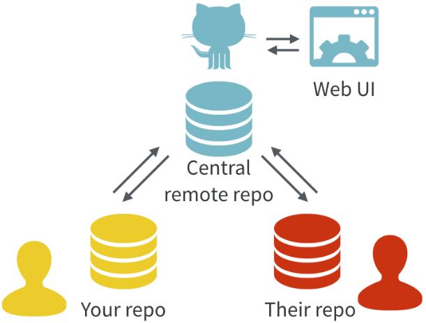

```{r xaringanExtra, include = FALSE}
xaringanExtra::use_xaringan_extra(c("broadcast", "webcam"))
```


# Links - \ (•◡•) /


- [Cheatsheet and commandline info](https://www.atlassian.com/git/tutorials/atlassian-git-cheatsheet)

- [Happy git with R](https://happygitwithr.com/big-picture.html#why-git)

- [Excuse me, do you have a moment to talk about version control?](https://peerj.com/preprints/3159v2/)

- [Software carpentry (commandline Git)](https://swcarpentry.github.io/git-novice/)

- [link to slides](https://quinnasena.github.io/GitHub_basics/git_slides.html#1)


Today's objective is to cover the minimum requirements to use Git for code reviews.

---

# Overview - (◕‿◕✿)

.pull-left[

- Git is a version control system for items like source code.

- Git is not for data storage although GitHub does have an option for large file storage (Git LFS).

- **Git** and **GitHub** are different things. Git is the version control system, GitHub is a cloud storage.

- There are alternatives to Git and GitHub. Git is commonly used.

- If all you want is a personal back-up system Git is not essential

]


.pull-right[
```{r, echo=FALSE, fig.align='center'}
knitr::include_graphics("versions_cartoon.png")
```
]

---

# Git language - :o)


**Git language** [see cheatsheet](https://www.atlassian.com/git/tutorials/atlassian-git-cheatsheet)

Git has its own 'verbs' for everything! Gets confusing so we will cover a few of the most important ones.

.pull-left[

**Git verbs for today**

- init (initialise)

- add

- commit

- push

- pull

- clone

- merge

]


.pull-right[

**Other Git things**

- Repository

- Staging area

- Local storage

- Remote host

]


???

Everything you need to do in Git has the form *verb* -> *argument*

Commandline Git is useful to know at some point but for personal use I like the GUI.


---

# Git workflow - ﴾͡๏̯͡๏﴿

- Local copy (stored on your personal machine)

- Remote copy (stored in the cloud)
 - Remote copies can be private, public or shared with specific collaborators


```{r, echo=FALSE, fig.align='center', out.width="50%", out.height=="50%"}

```


???

The idea is that git version control always moves forward. Even if you revert change it still exists.


---

# Git workflow - ﴾͡๏̯͡๏﴿ 

- Everything in Git can be done in the commandline.

- Use whatever method is most effective for your workflow, today we will use a GUI.

- A lot of Git things can be done either from your local machine or the remote repo, even some editing.

???

Commandline may be necessary for some work like with NeSI but 'there are no merit badges for being a git nerd'... actually there are...

---

# Git workflow - ﴾͡๏̯͡๏﴿ 


- **initialise** a local repository ('repo'). A repo is a working directory containing the files you wish to version control (e.g., a thesis, paper or analysis code).

- **add** a snapshot of the repo to a 'staging area': Tell git which changes to the repo you want to commit.

- **commit** files from the staging area. Takes a snapshot of the tracked files and stores them as a version. 
 - Each commit has a unique identifier. You can revert to a previous version of your project by using the identifier.
 - Each commit requires a commit message to write to your future self what you changed and why.

 
- **push** changes to a server such as GitHub (there are others). Upload files to a remote repo.

???

A repository is initialised once. Add, commit and push are done every time you back up your local copy to the remote server.

Git does not autobackup every x minutes. Can set up a cron job if you really want.

---

# Initialise - (ง'̀-'́)ง

1. Make a new directory somewhere on your computer.

2. Initialise a repo in that directory with a README.md and a .gitignore (in GitDesktop this steps 1 and 2 can be done at the same time).

 - a .gitignore file is a text file containing a list of items you *do not* want to keep track of or store (e.g., plot images generated from the source code).

 - Markdown files render in html so the README is viewed as a formatted document on a browser. I suggest using the README to outline the purpose of your code and detail problems.

3. Publish the repo to GitHub.


---

# add/commit and push - (ᵔᴥᵔ)

1. Make some changes to your README.md.

2. Add and commit the changes.

4. Push the changes to GitHub.

???
I recommend we use the README to outline the purpose of the code to review.


---
 
# Pull - (ง°ل͜°)ง

1. Edit your README.md on GitHub.

2. Pull changes to your local machine.


---

# Branching - ≧☉_☉≦

- So far we have been working on the master branch of your project.

- Branches allow you to make changes in parallel to your master branch without editing your primary working branch. Changes can be reviewed and merged to your master branch with a 'pull request'

---

# Branching - ಠ~ಠ

1. Create a branch in your Git GUI and navigate to that branch.

2. Edit your README.md and commit the changes to your new branch.

3. Create a 'pull request' to merge the changes with your master branch.


---

# Collaboration - ಠ╭╮ಠ

0. Pair up with someone.

1. GitHub go: settings -> manage access -> invite collaborator. Add each other as collaborators to your projects.

2. Clone their repository.

 - 'Clone' makes a copy of a remote repo on your local machine.

3. Make a new branch in their repo.

4. Make changes to their README.md, commit the changes to the branch and submit a pull request for them to review.

5. Review the changes they have made on your README.md and merge them with your master branch.


---

# Collaboration - ಠ╭╮ಠ


For the code review:

.pull-left[

For the **submitter**

1. Initialise a repo.

2. Create a branch for bug fixes.

3. Once changes have submitted to the branch, review them and **merge** with your master branch.

]

.pull-right[

For the **reviewers**

1. clone the repo.

2. do your thing.

3. submit changes **to the branch**.

]


---

# ̿̿ ̿̿ ̿̿ ̿'̿'\̵͇̿̿\з= ( ▀ ͜͞ʖ▀) =ε/̵͇̿̿/’̿’̿ ̿ ̿̿ ̿̿ ̿̿

- Git can do much much more, and also gets a lot more complicated....

- Git version control can all be done on the command line which is necessary when communing with NeSI.


